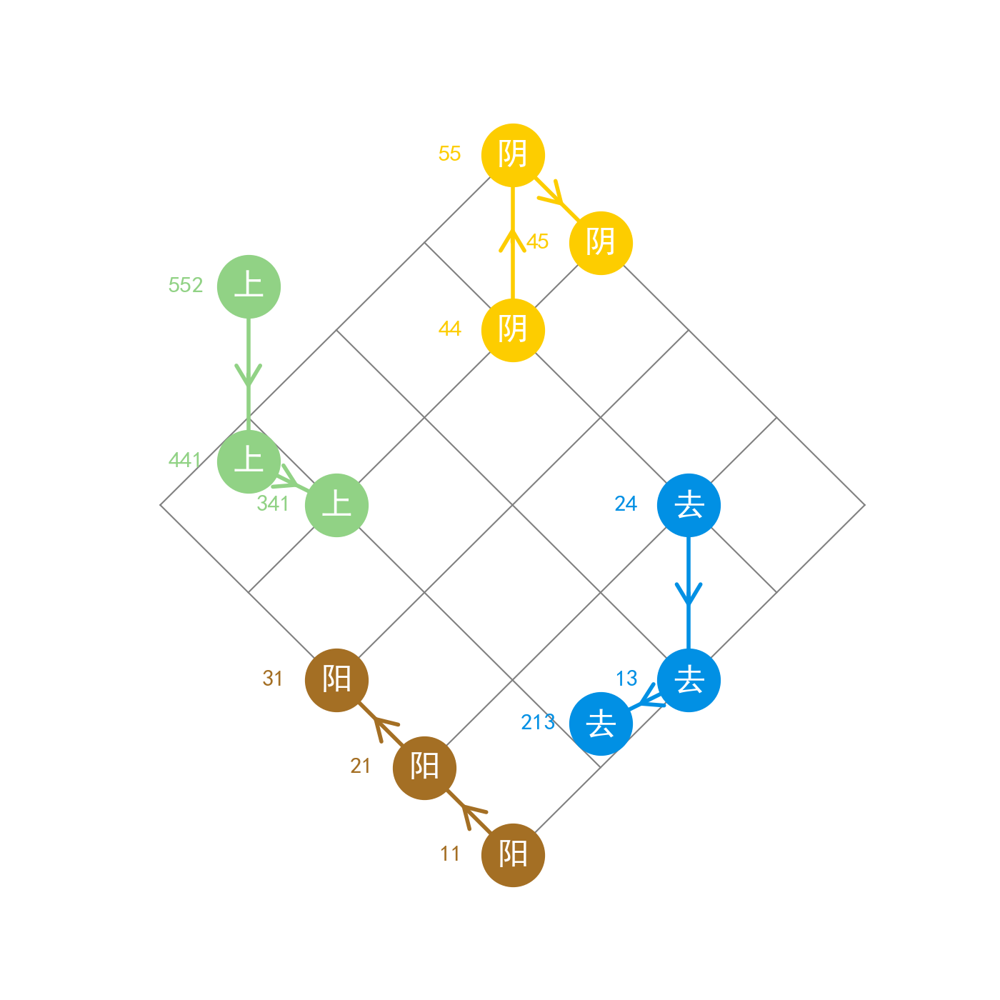

# UntPlot: UntPhesoca调值格局可视化图的Python绘图包
该可视化方案及配色方案均来自UntPhesoca发表在第十四届中国语音学学术会议(PCC 2021)上的《一种直观的调值格局可视化方法》，海报可见[unt的知乎专栏](https://zhuanlan.zhihu.com/p/391608723)或[unt的个人网站](https://phesoca.com/wp-content/uploads/linguistics/vis-tone-poster.pdf)。

# 使用方法
重庆格局的实例已经在`test.py`中给出，详见该文件。

- 引入包：

`from unt_plot import UntPlot`

- 实例化：

`up = UntPlot()`

此处可传入`figsize`与`grid_color`两个参数指明画布大小与网格颜色，默认值为`(14,14)`,`'grey'`

- 添加一条声调演化路径：

`up.create_path(text="阴", path=["44", "55", "45"], color="阴平")`

`UntPlot`类的方法`create_path()`函数接受以下参数：
- `text`: 标注文字
- `path`: 一个string组成的list，每个string是五度值调值，可以为曲折调，但不接受双折调
- `color`: 可以使用给每个调类的预设颜色，不分阴阳的调类请随意选取一个。也可以直接传入「金茶草柳蔚靛雪墨」中的一种，或任何matplotlib接受的颜色字符串（如：`'red'`或`'"#FDCD00"'`），不传入此参数，则依次在上述颜色种循环使用
    
  
# 技术细节
`unt_plot.py`种定义了两个类`UntPlotBase`与`UntPlot`，后者是前者的子类，可以调用父类方法实现更底层的操作。
